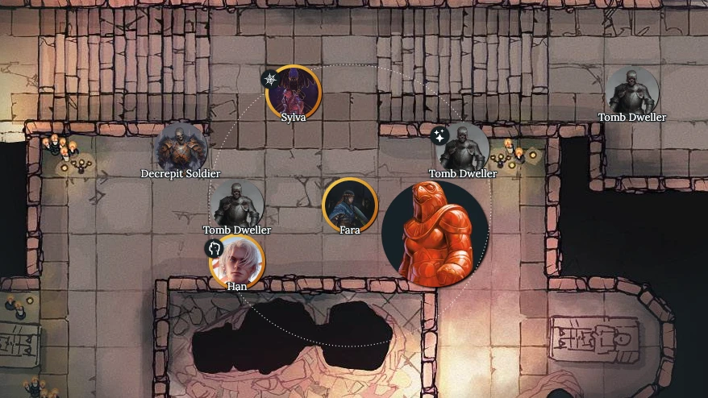

[ogres.app](https://ogres.app) is a free and open-source virtual tabletop that you can run in your browser and share with your friends.



## Features

- Instantly start preparing your game; no sign-ups or ads
- Start an online collaborative session for your friends
- Prepare and manage multiple scenes at once
- Built-in initiative tracker for streamlined encounters
- Responsive design for phones and tablets
- Easy to use for other game systems
- Polygonal fog tool
- ... and much more planned!

## Install

The following are instructions to start a local development environment (for developers only).

You'll need to have `node` and `clojure` installed.

```sh
# clone the repository
git clone git@github.com:samcf/ogres.git

# install dependencies
npm install

# start the local web server at http://localhost:8080
npm start

# start the application server necessary for hosting online sessions
clojure -X:server/dev
```

## Docker Environment

The following command will start the Docker environment.

```
docker compose up -d
```

This will open the appropriate ports, establish links between containers, set up volumes, and start the application as configured in `docker-compose.yaml`.
