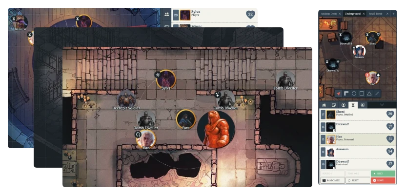

## Ogres Tabletop

[ogres.app](https://ogres.app) is a free and open-source virtual tabletop that you can run in your browser and use to play with your friends.



## Features

Ogres aims to be a very lightweight alternative to some of the more comprehensive tools available today. Its limited core feature-set is intended to help dungeon masters quickly setup encounters and adventures with only the most important necessities.

- Instantly start preparing your game; no sign-ups or ads
- Start an online collaborative session for your friends
- Prepare and manage multiple scenes at once
- Built-in initiative tracker for streamlined encounters
- Responsive design for phones and tablets
- Easy to use for other game systems
- ... and much more planned!

## Contributing

Interested in helping fix bugs or extending features? Look for issues labeled as **beginner friendly** and comment that you'd like to work on it. The following are instructions to start a local development environment (for developers only).

You'll need to have `node`, `npm`, and `clojure` installed.

```sh
#!/bin/sh

# copy the repository
git clone git@github.com:samcf/ogres.git

# install dependencies and start the local web server
# by default opens at http://localhost:8080
npm install --legacy-peer-deps
npm start

# optionally, start the application server necessary
# for hosting online sessions
clojure -X:server/dev
```

## Run your own server

You can run your own instance of this application by using Docker. For more information, refer to the [wiki docs](https://github.com/samcf/ogres/wiki/Docker-Usage). The following command will install and run the application.

```sh
#!/bin/sh
docker compose up -d
```
