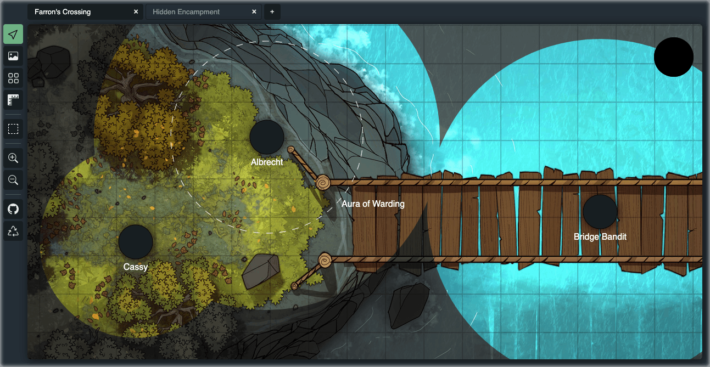

## ogre.tools

[ogre.tools](https://ogre.tools) is a free and open source virtual table top to help run your **Dungeons & Dragons 5th Edition** games. It is designed to be another tool in your dungeon master toolbox rather than an all-in-one solution. This application runs in your browser and relies exclusively on local storage to persist your uploaded maps, tokens, and the state of your workspaces.

This is a **work in progress** and not intended for serious usage at this time. It is under heavy development and will go through many more changes as it matures.

### Design Goals
* Free and open source &ndash; forever.
* Tailored for Dungeons & Dragons 5th Edition games.
* No account registrations, sign ups, or third party authorizations.
* Small number of well designed features.
* Runs entirely within your browser &ndash; no server necessary.
* Best experience on desktops.
* No rules engine or game data.

### Features
- Maps and Workspaces
  - [x] Upload and manage map images
  - [x] Manage maps across multiple workspaces
  - [x] Measure tool to display distance between two points
  - [ ] Weather and color temperature effects
- Grid
  - [x] Change grid size manually
  - [x] Change grid size by drawing a square over a tile
  - [x] Toggle grid display on and off
  - [ ] Keyboard shortcuts to adjust grid size and origin
  - [ ] Use filename to influence grid size (ex. `"duergar-castle-22x36.jpg"`)
- Tokens
  - [x] Create and manage tokens on the canvas
  - [x] Change token size
  - [x] Show aura radius and label
  - [ ] Upload and manage images for tokens
  - [ ] Define new token templates
  - [ ] Default token templates
  - [ ] Select and manage multiple tokens
- Drawing Shapes
  - [ ] Draw circles, rectangles, and lines
  - [ ] Update color, opacity, and position of drawn shapes
  - [ ] Draw custom polygons defined by a path
- Visibility and Screen Sharing
  - [x] Bright, dim, and dark lighting conditions
  - [x] Tokens can emit bright and dim light
  - [ ] Pop-out window suitable for screen sharing
  - [ ] Hide and reveal areas by drawing on the map
  - [ ] Tokens may be hidden in dark and dim lighting
- Data
  - [x] Reset the local workspace data
  - [ ] Export and import workspace data

### Contributing
This project is licensed under the [GNU AGPLv3](https://choosealicense.com/licenses/agpl-3.0/) to ensure that any changes made to the project are freely available to all users.

Since this project is in its infancy I'm not considering or accepting contributions at this time. Should you wish to make changes, please feel free to fork this project.

### Credit
This project is heavily inspired by [Owlbear Rodeo](https://owlbear.rodeo/), a fantastic VTT for the dungeon master tired of bulky and intrusive tools.
