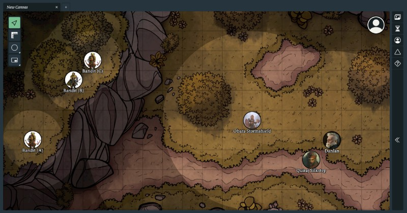

## ogre.tools

[ogre.tools](https://ogre.tools) is a free and open-source virtual tabletop to help you run your **Dungeons & Dragons 5th Edition** games. Find more information on the [project wiki](https://github.com/samcf/ogre.tools/wiki), including tips and keyboard shortcuts.

### Credits
- [Valkyrie](https://mbtype.com/fonts/valkyrie/) by Matthew Butterick
- [Bootstrap Icons](https://icons.getbootstrap.com/) by Bootstrap
